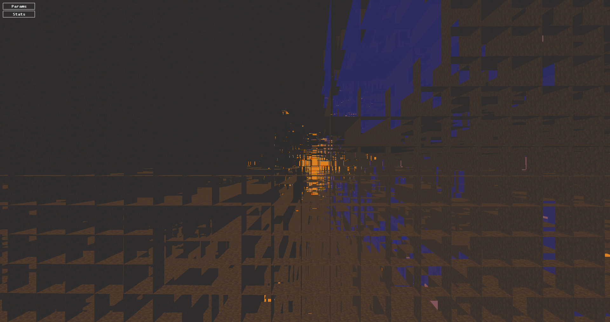
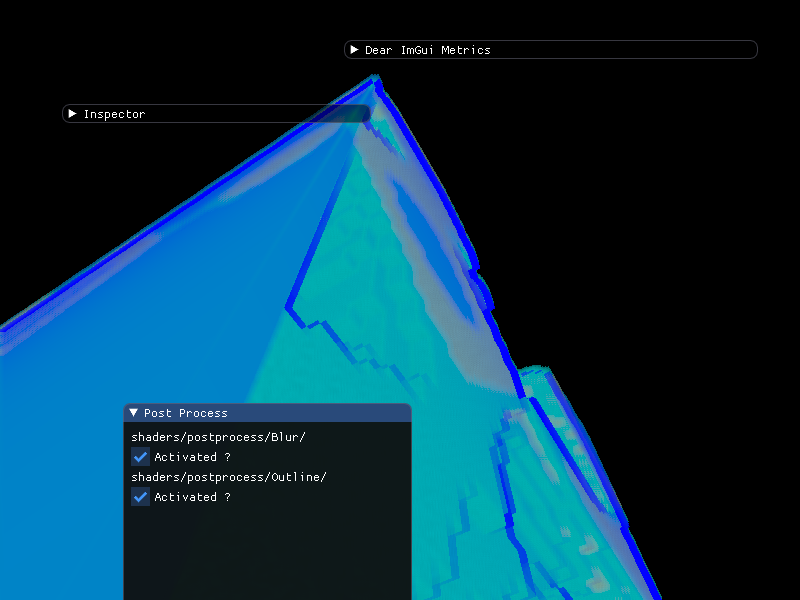

# DumberEngine
A c++ game engine, with forward rendering, Bullet and ImGui.

The engine has classic component based gameobjects, much like unity.

This project is intended to be a game engine for me to experiment on. I used it for a school project, but added some things i wanted (like bullet and ImGui). 
I plan to add Assimp and OpenAl, for lots of fun :) !

# Screenshots

## Interesting bug caused by a bad order of the vertices

## Some fun with shaders

## And a bit of fun with the post process stack

